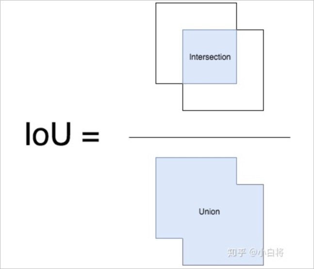
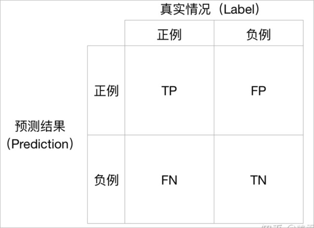
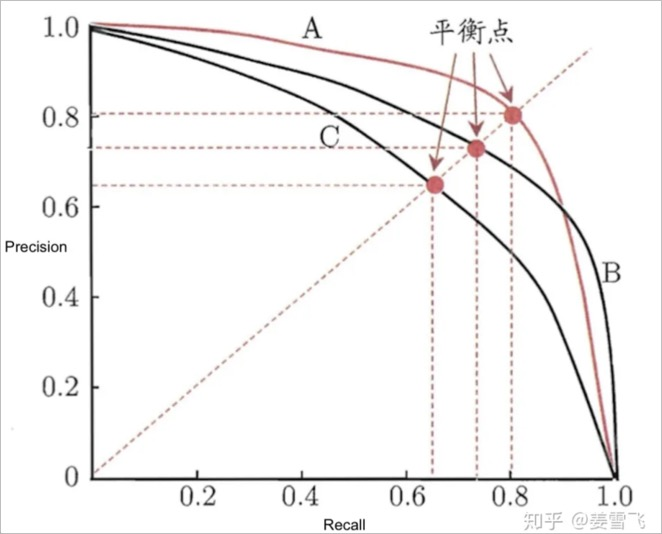

+++
title = '目标检测模型的评估指标mAP详解'
date = 2023-12-17T00:05:50+08:00
draft = false
categories = ['ML/DL']
tags = ['Deep Learning']
+++

mAP，即_Mean Average Precision，是目标检测领域最常用的评估指标。_

<aside> 💡 不同于常用的准确率，精度，召回率（recall），F1等评估指标。目标检测领域需要通过交并比 **IoU（Intersection of Union）来评估。**

</aside>

参考文章：

[目标检测模型的评估指标mAP详解(附代码）](https://zhuanlan.zhihu.com/p/37910324)

# 综述

目标检测问题可以用几个关键词来概括：

- 定位
- 分类
- 多对象

经典的图：

# **Ground Truth**

> 对于任何算法，评估指标需要知道ground truth（真实标签）数据。 我们只知道训练、验证和测试数据集的ground truth。

对于目标检测问题，ground truth包括图像中物体的类别以及该图像中每个物体的真实边界框(也就是人工标注的对象框)。

# IoU（Intersection over Union）

IoU是预测框与ground truth的交集和并集的比值。

对于每个类，预测框和ground truth重叠的区域是交集，而横跨的总区域就是并集。

IoU的计算公式：

# **计算precision和recall**

## 机器学习**分类模型**评估中常见的**性能度量指标**

### **Accuracy**

### **Precision and Recall**

Accuracy虽然常用，但是无法满足所有分类任务需求。

比如两个类别的数量非常悬殊（maybe 999999999999:1），我们要识别的是小的那个类别。为了提高准确率，最简单的做法是什么？把所有都预测为前者。但这个预测模型一点用都没有。为了突破accuracy的局限，我们需要计算precision和recall。

对于一个二分类任务，二分类器的预测结果可分为以下4类：

<aside> 💡 **Precision从预测结果角度出发**，描述了二分类器预测出来的正例结果中有多少是真实正例，即该二分类器预测的正例有多少是准确的；

**Recall从真实结果角度出发**，描述了测试集中的真实正例有多少被二分类器挑选了出来，即真实的正例有多少被该二分类器召回。

</aside>

Precision和Recall通常是一对矛盾的性能度量指标。

## 目标检测问题中的 **Precision and Recall**

为了获得True Positives and False Positives，我们需要使用IoU。

<aside> 💡 最常用的阈值是0.5，即如果IoU> 0.5，则认为它是True Positive，否则认为是False Positive。

</aside>

为了计算Recall，我们需要Negatives的数量。由于图片中我们没有预测到物体的每个部分都被视为Negative，因此计算True Negatives比较难办。

但是我们可以只计算False Negatives，即我们模型所漏检的物体。

另外一个需要考虑的因素是模型所给出的各个检测结果的置信度。通过改变置信度阈值，我们可以改变一个预测框是Positive还是 Negative，即改变预测值的正负性(不是box的真实正负性，是预测正负性)。

然后就可以根据上面给的公式计算目标检测结果的Precision and Recall了。

# mAP

<aside> 💡 目标检测中衡量识别精度的指标是mAP（mean average precision）。

多个类别物体检测中，每一个类别都可以根据recall和precision绘制一条曲线，AP就是该曲线下的面积，mAP是多个类别AP的平均值。

</aside>

参考：

目标检测中的mAP是什么含义？ - 隔壁大王的回答 - 知乎[https://www.zhihu.com/question/53405779/answer/139037721](https://www.zhihu.com/question/53405779/answer/139037721)

目标检测模型的评估指标mAP详解(附代码） - 小小将的文章 - 知乎 [https://zhuanlan.zhihu.com/p/37910324](https://zhuanlan.zhihu.com/p/37910324)

> 如前面所述，至少有两个变量会影响Precision和Recall，即IoU和置信度阈值。

IoU是一个简单的几何度量，可以很容易标准化，比如在PASCAL VOC竞赛中采用的IoU阈值为0.5，而COCO竞赛中在计算mAP较复杂，其计算了一系列IoU阈值（0.05至0.95）下的mAP。

但是置信度却在不同模型会差异较大，可能在我的模型中置信度采用0.5却等价于在其它模型中采用0.8置信度，这会导致precision-recall曲线变化。

为此，PASCAL VOC组织者想到了一种方法来解决这个问题，即要**采用一种可以用于任何模型的评估指标**。

可以看到，为了得到precision-recall曲线，首先要对模型预测结果进行排序（ranked output，按照各个预测值置信度降序排列）。那么给定一个rank，Recall和Precision仅在高于该rank值的预测结果中计算，改变rank值会改变recall值。这里共选择11个不同的recall（[0, 0.1, ..., 0.9, 1.0]），可以认为是选择了11个rank，由于按照置信度排序，所以实际上等于选择了11个不同的置信度阈值。那么，AP就定义为在这11个recall下precision的平均值，其可以表征整个precision-recall曲线（曲线下面积）。

总而言之就是，有两个变量会影响Precision和Recall，即IoU和置信度阈值，置信度阈值不同，对评估结果影响很大。取平均来抵消影响。