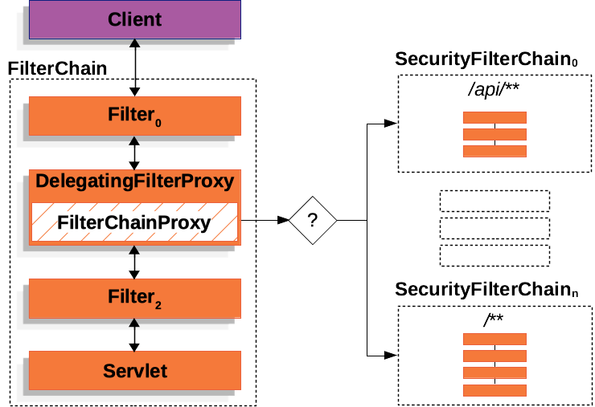

+++
title = 'Spring Security Jwt'
date = 2024-03-23T22:49:10+08:00
draft = false
categories = ['后端']
tags = ['Spring Boot', 'security']
+++

参考文档和视频：
- [Spring Security 官方中文文档](https://springdoc.cn/spring-security/servlet/architecture.html)
- [Spring Boot 3 + Spring Security 6 - JWT Authentication and Authorisation [NEW] [2023]](https://youtu.be/KxqlJblhzfI?si=wzzJWlUpDnVNcQ5E)
- [【项目实践】一文带你搞定Spring Security + JWT实现前后端分离下的认证授权](https://zhuanlan.zhihu.com/p/342755411)
- [秒懂SpringBoot之易懂的Spring Security教程](https://zhuanlan.zhihu.com/p/625403750)

Spring 提供了官方的示例代码： [spring-security-samples](https://github.com/spring-projects/spring-security-samples/tree/main)

# 基础的概念解析

## 认证和授权(Authentication v.s. Authorization)

认证意味着确认你自己的身份，而授权意味着授予对系统的访问权限(权限控制)。简单来说，认证是验证你的身份的过程，而授权是验证你有权访问的过程。

## JWT, OAuth2, SSO

是一种安全的授权框架，提供了一套详细的授权机制。用户或应用可以通过公开的或私有的设置，授权第三方应用访问特定资源。它详细描述了系统中不同角色、用户、服务前端应用（比如API），以及客户端（比如网站或移动App）之间怎么实现相互认证。

JWT提供了一种用于发布接入令牌（Access Token),并对发布的签名接入令牌进行验证的方法。 令牌（Token）本身包含了一系列声明，应用程序可以根据这些声明限制用户对资源的访问。

### 应用场景
- JWT适用于无状态的分布式API
- Oauth2适用外包认证服务器（第三方验证）
- Oauth2可以和JWT结合使用

### SSO
SSO是单点登录系统。可以利用JWT或者OAuth2等来实现。

# 引入
```gradle
dependencies {
	compile "org.springframework.boot:spring-boot-starter-security"
}
```

## 默认行为
只要引入依赖后，[SpringBoot和Spring Security就会默认提供一些行为](https://springdoc.cn/spring-security/servlet/getting-started.html#servlet-hello-auto-configuration)：

- 任何端点（包括 Boot 的 /error 端点）都需要一个认证的用户。
- 在启动时用生成的密码 注册一个默认用户（密码被记录到控制台；在前面的例子中，密码是 8e557245-73e2-4286-969a-ff57fe326336）。
- 用 BCrypt 以及其他方式保护密码存储。
- 提供基于表单的 登录 和 注销 流程。
- 对 基于表单 的登录以及 HTTP Basic 进行认证。
- 提供内容协商；对于web请求，重定向到登录页面；对于服务请求，返回 401 Unauthorized。
- 减缓 CSRF 攻击。
- 减缓 Session Fixation 攻击。
- 写入 Strict-Transport-Security，以 确保HTTPS。
- 写入 X-Content-Type-Options 以减缓 嗅探攻击。
- 写入保护认证资源的 Cache Control header。
- 写入 X-Frame-Options，以缓解 点击劫持 的情况。
- 与 HttpServletRequest 的认证方法 整合。
- 发布 认证成功和失败的事件。

## Servlet 和 SpringMVC

一个Java的类就是一个Servlet。

```java
public class LoginController extends HttpServlet {

    IUserService service = new UserService();

    @Override
    protected void doGet(HttpServletRequest req, HttpServletResponse resp) throws ServletException, IOException {
        
    }

    @Override
    protected void doPost(HttpServletRequest req, HttpServletResponse resp) throws ServletException, IOException {
        
    }
}

```

SpringMVC是对Servlet的封装，核心的DispatcherServlet最终继承自HttpServlet。DispatcherServlet又叫前端控制器，能过滤处理所有的请求方法。

> 这两者的关系，就如同MyBatis和JDBC，一个性能好，一个开发效率高，是对另一个的封装。

# 架构
参考[【项目实践】一文带你搞定Spring Security + JWT实现前后端分离下的认证授权](https://zhuanlan.zhihu.com/p/342755411)和[官方文档：Spring Security/Servlet 应用/架构](https://springdoc.cn/spring-security/servlet/architecture.html)以及[Servlet 认证架构](https://springdoc.cn/spring-security/servlet/authentication/architecture.html)理解就没有问题了。

Web中登录认证的核心就是**凭证机制**。用户登录成功后返回用户一个凭证，后续用户访问接口需携带凭证来表示自己的身份（Session， JWT...）。

后端会对需要进行认证的接口进行安全判断，若凭证没问题则代表已登录就放行接口，若凭证有问题则直接拒绝请求。**这个安全判断都是放在过滤器里统一处理的。**

**Spring Security对Web系统的支持就是基于这一个个过滤器组成的过滤器链。**



> Spring Security的核心逻辑全在这一套过滤器中，过滤器（比如认证过滤器，授权过滤器等等）里会调用各种组件（密码Encoder, SecurityContext等等）完成功能，掌握了这些过滤器和组件你就掌握了Spring Security。

## SecurityContextHolder
每个用户都会有它的上下文（SecurityContext），存储在一个SecurityContextHolder中。

所以我理解的是会在Filter中校验是否通过认证，通过了就会往SecurityContext中存入Authentication（代表当前登录用户），这样就能通过`UsernamePasswordAuthenticationFilter`。

如果是login接口，就不太一样，需要自己调用`authenticationManager`提供的`authenticate()`方法。

## AuthenticationManager
AuthenticationManager 就是Spring Security用于执行身份验证的**组件**，只需要调用它的authenticate方法即可完成认证。

Spring Security默认的认证方式就是**在UsernamePasswordAuthenticationFilter这个过滤器中调用这个组件**，该过滤器负责认证逻辑。

AuthenticationManager会**根据用户名查询出用户对象**，与传递过来的密码匹配。

户对象数据可以存在内存中、文件中、数据库中，你得确定好怎么查才行。这部分就交给UserDetialsService来实现。

## UserDetialsService
该接口只有一个方法loadUserByUsername(String username)，通过用户名查询用户对象，默认实现是在内存中查询。

## UserDetails
每个系统中的用户对象数据都不尽相同，咱们需要确认我们的用户数据是啥样的才行。Spring Security中的用户数据则是由 UserDetails来体现，该接口中提供了账号、密码等通用属性。

## PasswordEncoder组件
这个组件负责密码加密与校验。Spring Security提供了很多加密器实现。

## AuthenticationEntryPoint组件
定义自己的错误处理逻辑。

## JWT组件
JWT是很小的一部分，有很多库的实现。

- jjwt
- java-jwt
- jose4j
- ...

自己引用在Spring Security的Filter等等部分使用。Spring Security是一个安全框架，更high level。

# 配置
